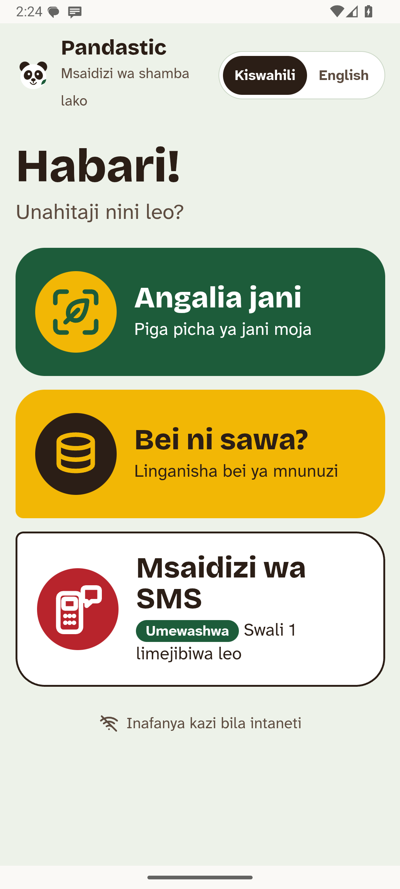
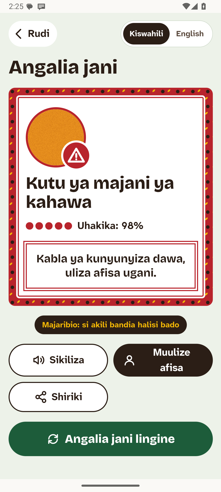
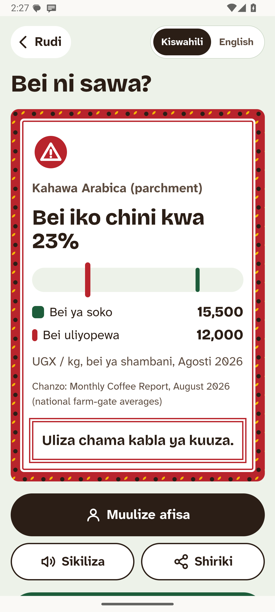
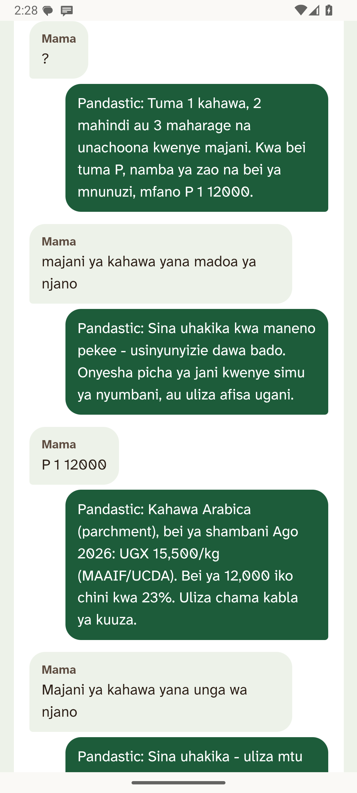
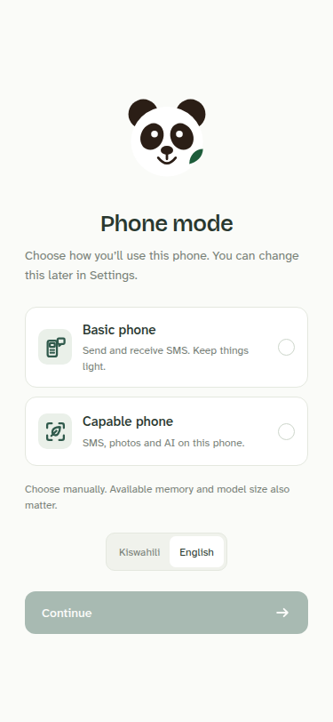
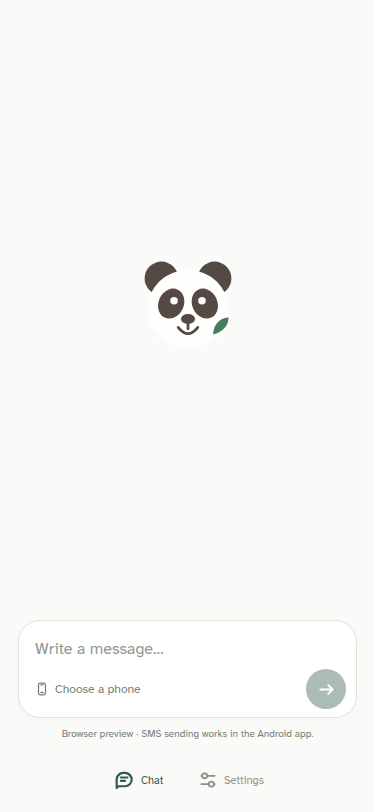
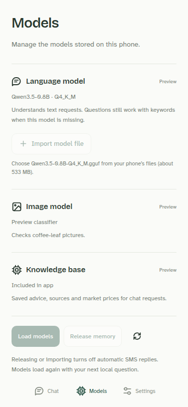

# Pandastic: a farm helper that answers by SMS, with no internet

Pandastic is our entry for the **Small AI for Development** hackathon (World Bank Youth Summit × Hack-Nation, agriculture track).

Noor grows coffee, maize and beans in the highlands. Her own phone is a basic phone. Her daughter's smartphone stays at the house, and there is no Wi-Fi. The extension officer comes twice a year, and at harvest a buyer names a price she cannot check.

Pandastic runs entirely on the daughter's Android phone:

- **From the slope, by SMS.** Noor texts the house phone from her basic phone, e.g. `P 1 12000` ("is 12,000 a fair coffee price?") or a symptom in her own words. The phone answers by SMS in Swahili within seconds. It uses carrier SMS only: no data bundle, no Wi-Fi, no cloud.
- **At home, by photo.** A photo of a leaf is checked by an on-device image classifier. The picture and reply appear in chat, with the finding, cited advice and instructions to ask an extension officer when needed.
- **Before selling.** The buyer's offer is compared with the latest official farm-gate price (MAAIF/UCDA) or market price (WFP).

The following screenshots show the earlier farm-tool interface; the current app uses the two phone modes described below.

| Previous home | Leaf check | Price check | SMS helper |
| :-: | :-: | :-: | :-: |
|  |  |  |  |

## How it works

### Choose this phone’s role

On first launch, select **Basic phone** or **Capable phone**. Android displays total RAM; the owner chooses the mode and can change it in Settings.

- **Basic phone:** a clean SMS conversation and Settings. It sends and receives SMS through the SIM without loading local models.
- **Capable phone:** the same chat interface, plus **This phone** for local questions, camera/gallery attachments in the composer, and a **Models** page for inventory, load/release and file import. Automatic SMS replies remain optional and use the existing allowlist. Switching to Basic mode disables the responder and unloads models after active work finishes.

The chat has no header or welcome text; an empty conversation shows only the panda. Price requests are handled through chat. Pictures are checked locally and are not sent by SMS. See [frontend/README.md](frontend/README.md) for two-phone setup. A phone without the app can still use ordinary SMS; React/WebView performance on a 0.5 GB phone has not been measured.

| Setup | Basic phone | Capable phone · attachments | Models |
| :-: | :-: | :-: | :-: |
|  |  |  |  |

These are browser previews; carrier SMS is available in the Android app.

### Local processing and SMS

```text
 Noor's basic phone ──SMS──► SmsReceiver ─► HubService (allowlist, rate limit, store-and-forward log)
                                              │
 Daughter's phone UI (React in WebView) ──────┤  NativeBridge
   photo ─► QualityGate ─► LeafClassifier (ONNX) ─┐
   text / SMS ─► KeywordNlu + Qwen3.5-0.8B (llama.cpp, GBNF; fills what keywords miss)┐
                                                   ▼                                  ▼
                               Resolver (thresholds and statuses in code) ◄── knowledge.sqlite
                                                   │                      (cited advice, prices, lexicon)
                                                   ▼
                               Decision ─► reply in chat  /  ≤ 2-part SMS (safety line first)
```

| Part | What | Size |
| :-- | :-- | :-- |
| Leaf classifier | 3 × EfficientNet-B0 averaged in one ONNX file (int8 weights), 14 labels: coffee, maize and bean leaf problems, healthy leaves, and "not a leaf". Trained on photos from Brazil, Kenya, Ecuador, Ghana and Uganda; temperature-calibrated, with stricter floors for "healthy" chosen on calibration photos run through the app. A plant-share and blur gate runs first. Held-out, in the app: coffee phone photos 97.4% right when it answers, no rust leaf called healthy ([docs/DATA.md](docs/DATA.md) §2.2). | 12.7 MB |
| Language model | Qwen3.5-0.8B Q4_K_M (Apache-2.0, multilingual), fine-tuned with LoRA on farmer SMS, via llama.cpp under a GBNF grammar. It reads every message; its reading is used only where the keywords found nothing (the intent, and a symptom under strict conditions), and each reply ends with one fixed line saying what it understood ("AI ya simu imeelewa: bei, kahawa, 12,000."). It never writes advice. | 542 MB, optional: downloaded once in the app (opt-in) or imported from a file |
| Knowledge base | SQLite: cited advice (EN + SW), UCDA/MAAIF coffee farm-gate prices, WFP maize and bean prices, SW/EN lexicon | 360 KB |
| App | Java + React (bundled, offline). The INTERNET permission is used for one thing, the opt-in model download; questions, photos and answers never go online, and the WebView blocks every network load. | ~40 MB (arm64 release) |

Peak memory with the language model loaded is under 1 GB (the model file is memory-mapped) on the 4 GB target phone.

## Guardrails (the brief's pass/fail criterion)

- **Fixed list of answers.** Every user-facing sentence is a template or a cited advice row. Models only choose labels and slots, which are checked in code.
- **"Not sure — ask a person."**
  - A blurry photo, a low-confidence result or an unknown object leads to "ask a person, don't spray yet".
  - Text alone is never treated as a diagnosis.
  - Old prices are flagged as old.
- **The person decides.** Chat preserves instructions to ask an officer and never treats text alone as a confirmed diagnosis. The owner explicitly opts in to automatic SMS replies.
- **The language model never decides alone.** The base model invented a symptom for vague text during testing, so the model may add a symptom only if it is the fine-tuned file, the SMS reports a problem, the keywords found the crop, and the label is a real problem (never "healthy"). Crop, price and language always come from keywords. Text alone is never a confident diagnosis. Measured on `fresh2`, SMS written before the last keyword fixes ([ml/reports/nlu_eval_lora.md](ml/reports/nlu_eval_lora.md)): the same reply as the reference for 93% with keywords + model, 83% with keywords alone.
- **Airtime and privacy.**
  - Only numbers the owner lists get answers, and short codes are ignored.
  - Replies are rate-limited.
  - Messages stay on the phone and can be cleared.

## Data

All sources, licences and sizes, the evidence for the problem, and **what the data does not cover** are in [docs/DATA.md](docs/DATA.md).

## Run it

Requirements: JDK 17, Android SDK 35, NDK `28.2.13676358` with CMake 3.22.1 (for llama.cpp), Node 20+ and **Corepack** (Gradle runs the pnpm version pinned in `frontend/package.json`) or, on Node 25+ where Corepack is no longer bundled, a global **pnpm**.

```sh
make run            # start/select emulator, build + install + launch; plain make does the same
make run-device     # same on a USB-connected phone
make release        # 40 MB arm64 APK for side-loading
make web            # UI only, in a desktop browser (labelled demo answers)
make stop           # shut down the running emulator
cd android && ./gradlew testDebugUnitTest   # resolver, NLU, SMS formatting, number matching
```

With one available AVD, `make run` selects it automatically; with one running emulator, it reuses it. With multiple AVDs or emulators, select `EMULATOR_NAME=Your_AVD` or `DEVICE=emulator-5554` (also accepted by `make stop`). An invalid AVD name or an emulator crash reports an error immediately. Startup logs are in `/tmp/pandastic-emulator.log`; `BOOT_TIMEOUT=180` controls the maximum wait. The first build may download pnpm and dependencies; the installed app runs offline.

Building without the NDK: `./gradlew -Pnollm assembleDebug`. The app then works with keyword understanding only.

To side-load the language model and simulate Noor's SMS on the emulator (`adb emu sms send 0700000001 "P 1 12000"`), see [docs/DEMO.md](docs/DEMO.md). It also has the test scenarios and the video script.

Training runs on [Modal](https://modal.com): `cd ml && modal run modal_app.py --stage all` (leaf classifier) and `modal run modal_lora.py` (optional Qwen LoRA). See [ml/README.md](ml/README.md).

## Repository

```text
android/app/src/main/java/org/pandastic/relay/
  FrontendActivity.java, NativeBridge.java   React host + JS bridge (window.PandasticNative)
  BrainHost.java                             one model thread shared by the UI and the SMS hub
  hub/                                       SMS receiver, foreground service, allowlist, log, sender
  brain/                                     classifier, quality gate, resolver, NLU (keywords + Qwen), SMS formatter
android/app/src/main/cpp/                    llama.cpp JNI (fetched at build time, v0.5.0)
frontend/                                    React UI (Swahili first), bundled into the APK
ml/                                          Modal training, knowledge-base builder, NLU evaluation
data/                                        price, advice and lexicon sources for knowledge.sqlite
docs/                                        AUDIT (design review), DATA, DEMO, contracts, screenshots
LEDGER.md                                    how the two coding agents split and tracked the work
```

## Limits we state openly

- **Photos:** coffee, maize and bean leaves only. No coffee berry disease photos. Coffee photos from one country transfer poorly to another, so held-out results are per source ([docs/DATA.md](docs/DATA.md)). When unsure, the app says so and asks for a person.
- **Swahili:** the text is machine-translated and needs review by native speakers.
- **Prices:** national averages, not Noor's own market.
- **Allowlist:** it controls cost; it is not authentication, because caller ID can be spoofed.
- **Language model:** a one-time 542 MB download over mobile data (opt-in), or a file copied to the phone. Everything works without it.
- **Not yet tested:** a real 4 GB phone, real carrier SMS delays, the helper surviving a night of Android battery saving.
